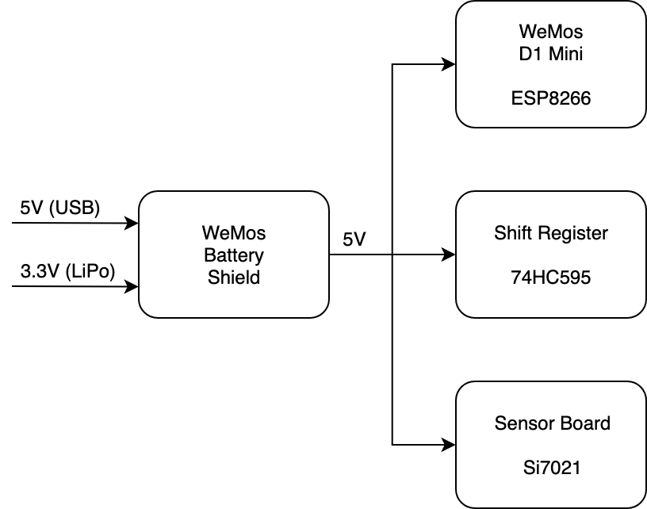

# Design

## Power tree schematic

> A power tree is a graphical representation of your system’s power management architecture. The power tree illustrates the main supply power flow through a tree of power converters that convert the main supply power to the voltage and current required to drive various loads. - Intel's Creating an FPGA Power Tree

## References

- [Creating an FPGA Power Tree](https://www.intel.com/content/dam/www/programmable/us/en/pdfs/literature/an/an-721-creating-fpga-power-tree.pdf)
- [System-Level Design Tool Quick Start Guide](https://www.analog.com/media/en/technical-documentation/user-guides/ltpowerplanneriii_qsg.pdf)
