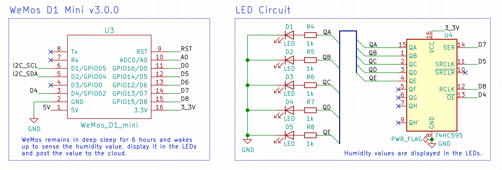

# Humidity with LED

Display humidity in a bar graph LED

## Hardware

## Firmware

With [Arduino code](main.ino)

## Reference

- [DHT-sensor-library](https://github.com/adafruit/DHT-sensor-library/blob/master/examples/DHTtester/DHTtester.ino) from Adafruit
