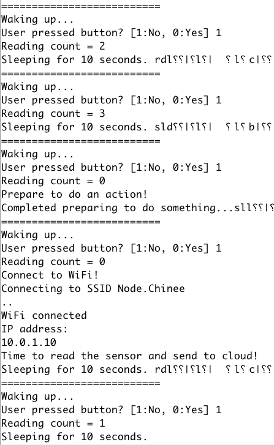

# Wake up periodically or on button press

Send sensor data to cloud periodically or by pressing the button on-board.

## Firmware [[link](main.ino)]

Features:

- Wakeup
  - periodically without any WiFi to save battery
  - upon user button press
- Increment the interval count on the RTC memory
- Connect to WiFi and do something only if the interval count of the wakeup is correct or the user has pressed button

## References

- [Synchro Clock config pin schematic](https://raw.githubusercontent.com/liebman/AnalogClock/master/images/SynchroClock.png)
