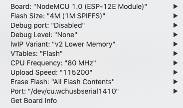

# Wake up periodically

Wake up periodically after a specified time

## Hardware

Short `RST` and `GPIO012` on ESP (or `D6` on WeMos)

## Firmware [[link](main.ino)]

## Arduino settings

## Console

`115200` baud
