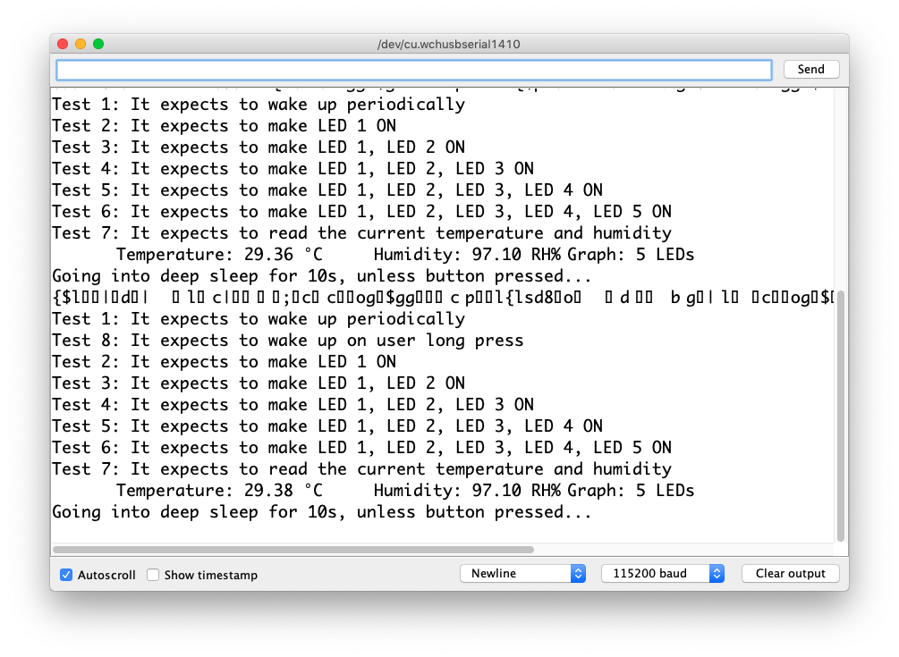
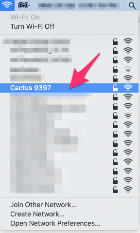
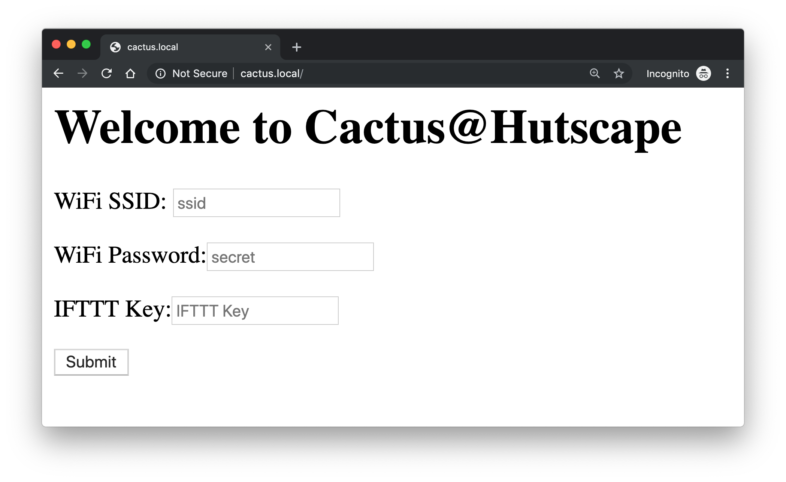
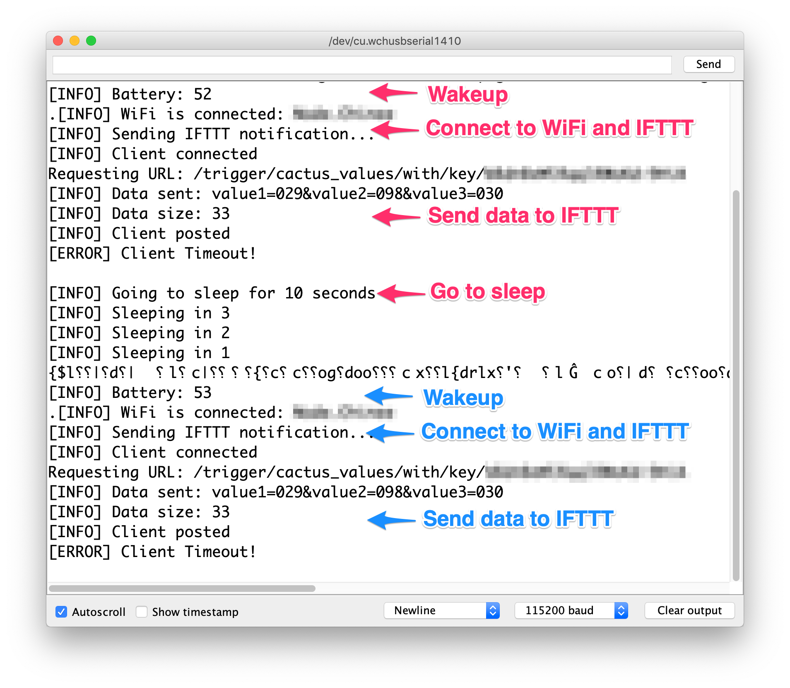

# Firmware

Firmware contains parts of the circuit prototyped and tested separately.

## Development

### Arduino IDE settings

- Board: NodeMCU board ESP-12E
- Flash size: `4M`
- CPU Frequency: `80MHz`
- Upload speed: `115200`
- Port: `/dev/cu.wchusbserial1410`

## Design verification test

Run [`test.ino`](test.ino) to ensure PCB works!

## Main function

- [x] Read humidity from the sensor
- [x] Read temperature from the sensor
- [?] Read battery levels
- [x] Display humidity values in the LEDs
- [ ] Wakeup every 4 hours
- [x] Wakeup on long button press
- [x] Check for stored WiFi credentials
- [x] Connect to WiFi with the stored credentials
- [x] Setup an AP mode if WiFi cannot be connected
- [x] Send sensor and battery values to IFTTT if WiFi is connected
- [ ] Wait for 5 minutes in AP mode is WiFi is not connected
- [x] Sleep after sending data to IFTTT
- [ ] Sleep after waiting for 5 minutes in AP mode

1. Flash the [main firmware](firmware.ino)
1. Connect to the access point

    
1. Go to the web page `http://192.168.4.1`

    
1. Key in the WiFi `SSID`, WiFi `password` and [IFTTT webhook key](https://ifttt.com/services/maker_webhooks/settings)
1. Wait for the [Google Sheet](https://docs.google.com/spreadsheets/d/1qedLXiCeU6vCwEvv3JqwrVWjrriB8L3DA9Xp-g01Jk0/edit?usp=sharing) to update with a new row

    
    
