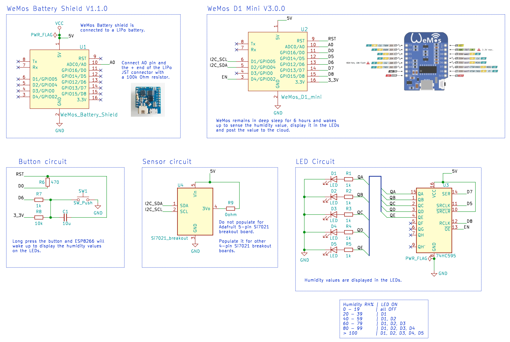
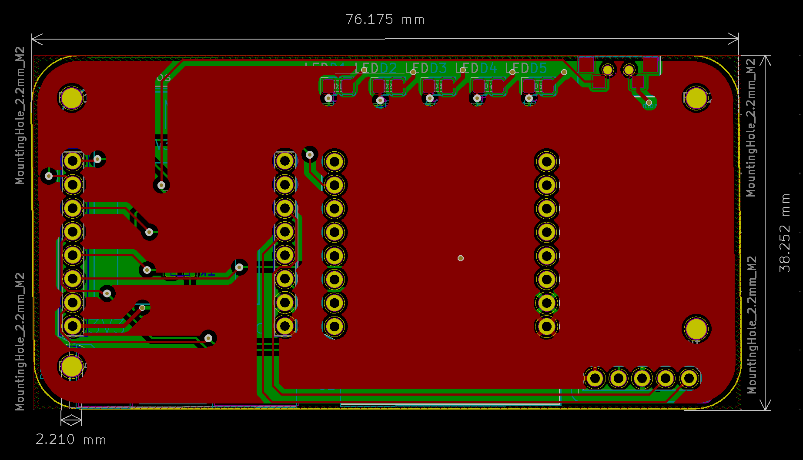
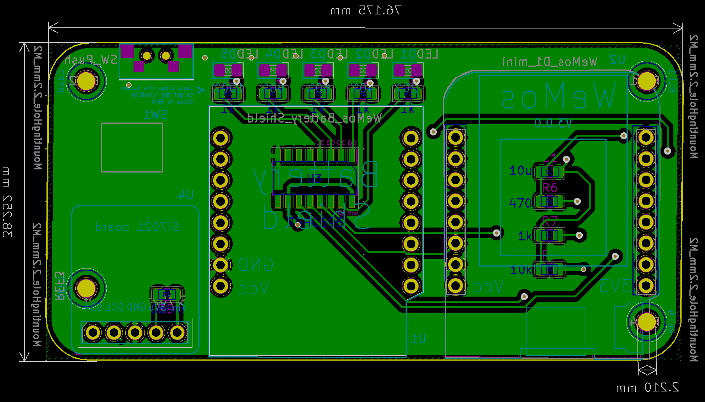
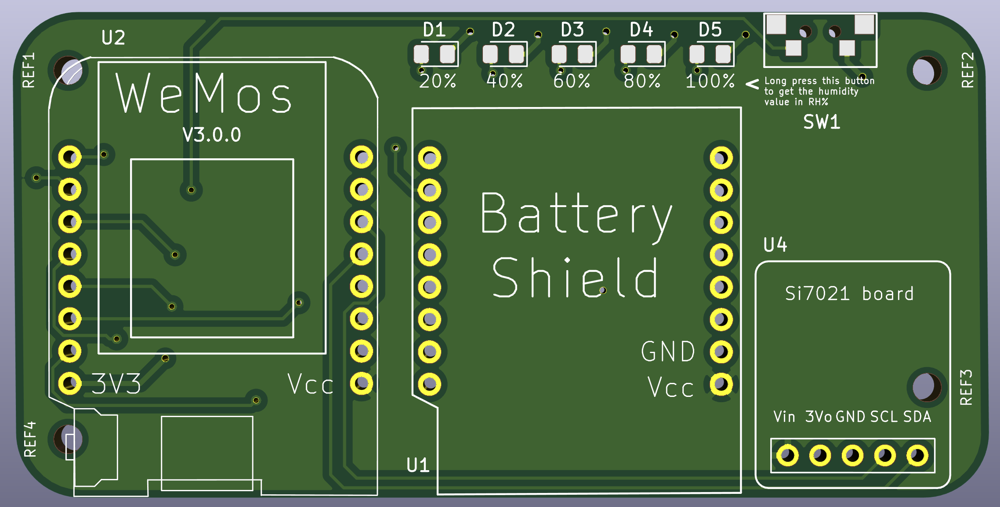
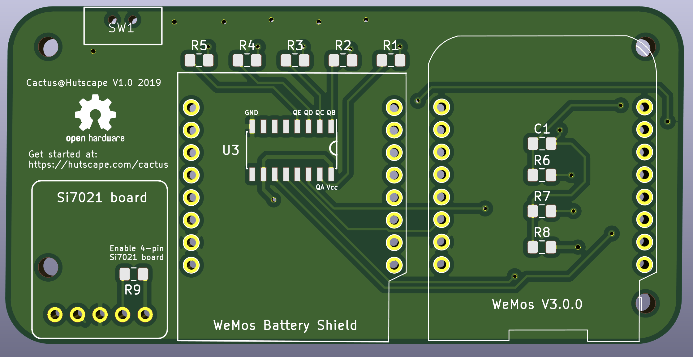

<section class="section is-small">
  

    <h2 class="title is-1">Schematic</h2>

    View the [schematic](images/schematic.pdf) and [footprint](images/footprint.pdf) in PDF format.

    ## Main components

    1. PCB (1x)
    1. WeMos D1 Mini `v3.0.0` (1x)
    1. WeMos Battery shield `v1.1.0` (1x)
    1. LiPo `1200mAh` battery with JST PH2 connector (1x)
    1. `M2` nuts (4x)
    1. `M2` spacers `15mm` height (4x)

    Connect pins `A0` and positive `+` terminal of the LiPo JST connector on the battery shield with a `100k ohm` resistor.

    

    ## Prototype

    
    
    
    

    <h2 class="title is-1">Footprint</h2>

    View the [PDF](images/schematic.pdf) version

    

    ## Footprint

    View [PDF](images/footprint.pdf) version

    Front

    

    Back

    

    <h2 class="title is-1">3D View</h2>

    Front

    

    Back

    
  

</section>
