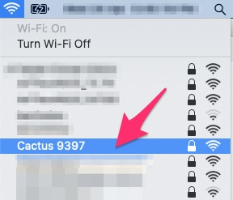
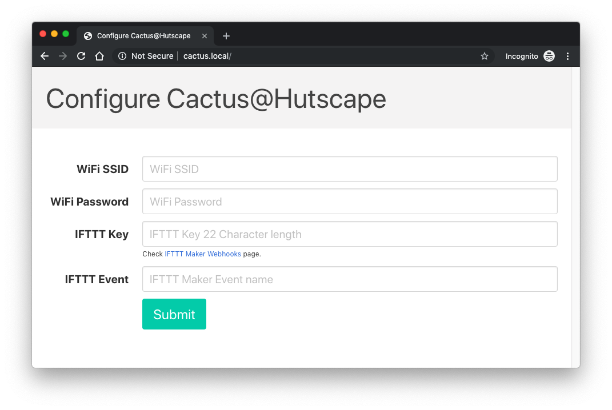
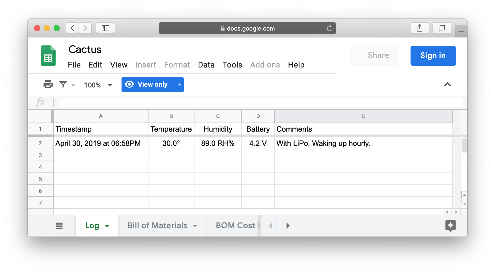

<section class="section is-small">
  

    

      

      

      

      

    

  

</section>

<section class="section is-small">
  

    <h2 class="title is-1">Getting Started</h2>

    

      

        

          

            <article class="tile is-child notification">
              
Step 1

              
Setup an <a href="https://ifttt.com/services/maker_webhooks">IFTTT webhook</a> to receive a POST request with data and add a row to a Google Spreadsheet.

              
            </article>
          

          

            <article class="tile is-child notification">
              
Step 2

              
Connect to the WiFi access point <code>Cactus {UNIQUE_MAC_ADDRESS}</code>.

              
Go to the web page <code>http://cactus.local</code> to fill in the WiFi credentials and <a href="https://ifttt.com/services/maker_webhooks/settings">IFTTT webhook key</a>.

              
              
            </article>
          

          

            <article class="tile is-child notification">
              

                
Step 3

                
Press on-board button or wait for the <a href="https://docs.google.com/spreadsheets/d/1qedLXiCeU6vCwEvv3JqwrVWjrriB8L3DA9Xp-g01Jk0/edit?usp=sharing">Google Sheet</a> to update with a new row with a periodic update to the cloud.

                
              

            </article>
          

        

      

    

  

</section>

<section class="section is-small">
  

    <h2 class="title is-1">Maintenance</h2>

    

      <ul>
        <li>⚠️ <strong>USB Connectors on WeMos D1 Mini vs WeMos battery shield</strong>
          <ul>
            <li>Do not plug in the USB cable on WeMos D1 Mini while the battery shield is on the PCB</li>
            <li><strong>Flashing firmware</strong>: Remove the battery shield from the PCB and use the USB cable on the WeMos D1 mini</li>
          </ul>
        </li>
        <li>Charge the LiPo by plugging in the USB cable into the battery shield</li>
      </ul>
    

  

</section>
