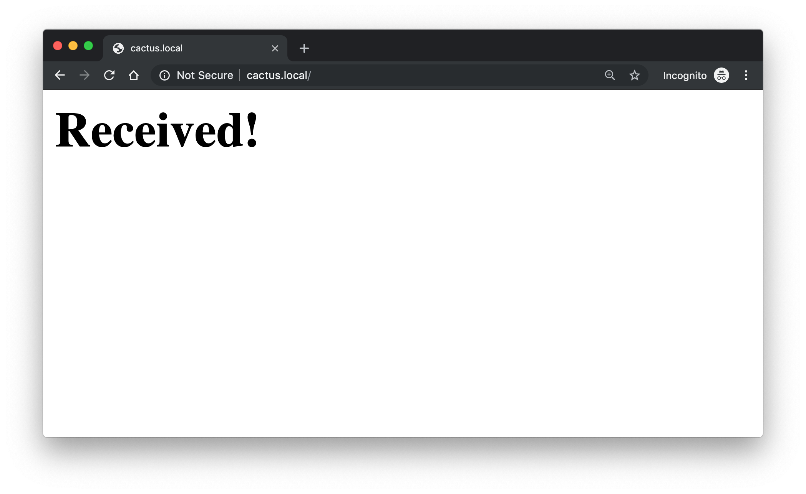

## Getting started

1. Setup an [IFTTT webhook](https://ifttt.com/services/maker_webhooks) to receive a POST request with data and add a row to a Google Spreadsheet

    
1. Connect to the access point

    
1. Go to the web page `http://cactus.local` to fill in the WiFi credentials and [IFTTT webhook key](https://ifttt.com/services/maker_webhooks/settings)

    
    
1. Wait for the [Google Sheet](https://docs.google.com/spreadsheets/d/1qedLXiCeU6vCwEvv3JqwrVWjrriB8L3DA9Xp-g01Jk0/edit?usp=sharing) to update with a new row

    

## Maintenance

- ⚠️ **USB Connectors on WeMos D1 Mini vs WeMos battery shield**
    - Do not plug in the USB cable on WeMos D1 Mini while the battery shield is on the PCB
    - **Flashing firmware**: Remove the battery shield from the PCB and use the USB cable on the WeMos D1 mini
- Charge the LiPo by plugging in the USB cable into the battery shield
