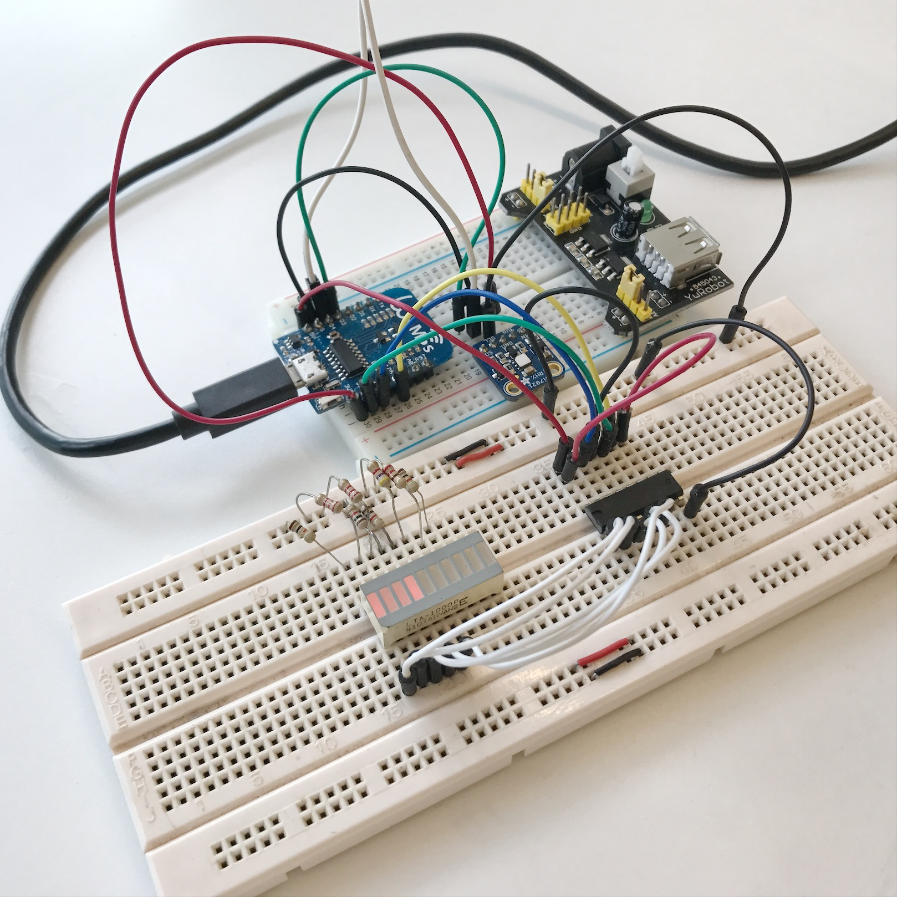
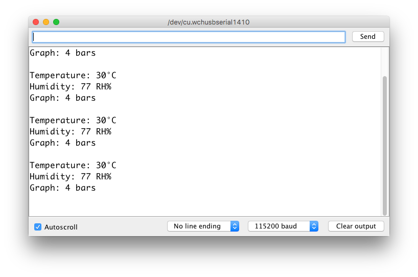

# Cactus

> Measure humidity and temperature periodically or on button press

- **Wireless:**	WiFi
- **Sensors:**	1 (Si7021)
- **Power:**	3.7V LiPo 1200mAh via Battery shield
- **Processor:**	ESP8266 with WeMos D1 Mini
- **Modules:** 3 (MCU, power shield, sensor)
- **Firmware:**	Arduino ESP8266
- **OTA?**	No
- **Works without Internet?**	Yes
- **BOM Total Items:**	20
- **BOM Unique Items:** 6
- **PCB Manufacturing vendor:**	JLCPCB
- **BOM vendor:** Mouser, AliExpress, 12Geeks
- **Total vendors:** 4 (PCB, BOM, battery, power shield)
- **Total units:** 1

## Development

Run `make install` to add git-secrets and git pre-commit hooks.

## Getting started

1. Connect the hardware according to the instructions in the [firmware](firmware/03-display-humidity-with-led.ino)

    
1. Flash the [firmware](firmware/03-display-humidity-with-led.ino) with the Arduino IDE
1. View the temperature and humidity values on the Arduino serial monitor with baud rate `115200`

    
1. Ensure the bar LEDs are lit accordingly

## Hardware

### Schematic

### Footprint

Front

Back

### 3D View

Front

Back

## Lessons Learnt

> Good practices to continue for future projects

- Always buy electronics modules for first time use
- Do a power tree analysis before schematic design
- Test out paper mockups for mechanical dimensions
- Do a mechanical consideration before laying out the footprint
- Ensure BOM stocks are available from vendors before laying out the footprint

## References 📚

### Similar projects

1. [Shelly H&T is a Battery Powered ESP8266 WiFi Temperature & Humidity Sensor](https://www.cnx-software.com/2018/10/30/shelly-ht-battery-powered-esp8266-wifi-temperature-humidity-sensor/)

### Humidity and Temperature Sensor Si7021

1. [Adafruit Si7021 Temperature & Humidity Sensor Breakout Board](https://www.adafruit.com/product/3251)
1. [Arduino library for SI7020 and SI7021 environmental sensors](https://github.com/LowPowerLab/SI7021)
1. [MINI Si7021 Temperature and Humidity Senso](http://www.instructables.com/id/MINI-Si7021-Temperature-and-Humidity-Sensor/)
1. [ESP8266 and Si7021 temperature sensor example](https://www.esp8266learning.com/esp8266-si7021-temperature-sensor-example.php)

### Power

#### Coin Cell

1. [ESP8266 Sensor runs 17 days on a coin cell](https://www.youtube.com/watch?v=IYuYTfO6iOs)
1. [How to build an open WiFi finder using ESP8266 and two coin batteries](https://medium.com/@kstevica/how-to-build-an-open-wifi-finder-using-esp8266-and-two-coin-batteries-9c31eb6f9859)
1. [How to Run Your ESP8266 for Years on a Battery](https://openhomeautomation.net/esp8266-battery/)

#### Battery shield

1. [WeMos battery shield](https://arduinodiy.wordpress.com/2017/01/02/reviewing-the-wemos-battery-shield/)
1. [Power usage of WeMos and battery shield](http://harald.studiokubota.com/wordpress/index.php/2016/08/20/power-usage-of-wemos-d1-mini-ws2812b-rgb-shield/)
1. [Battery shield docs and schematic](https://wiki.wemos.cc/products:d1_mini_shields:battery_shield)
1. [WeMos lithium battery shield](https://www.youtube.com/watch?v=z6Vgy1cY0XU)

### Programming

1. [ESP8266 pogo jig programming](https://hackaday.io/project/20046-esp8266-pogo-jig-programming-board)
