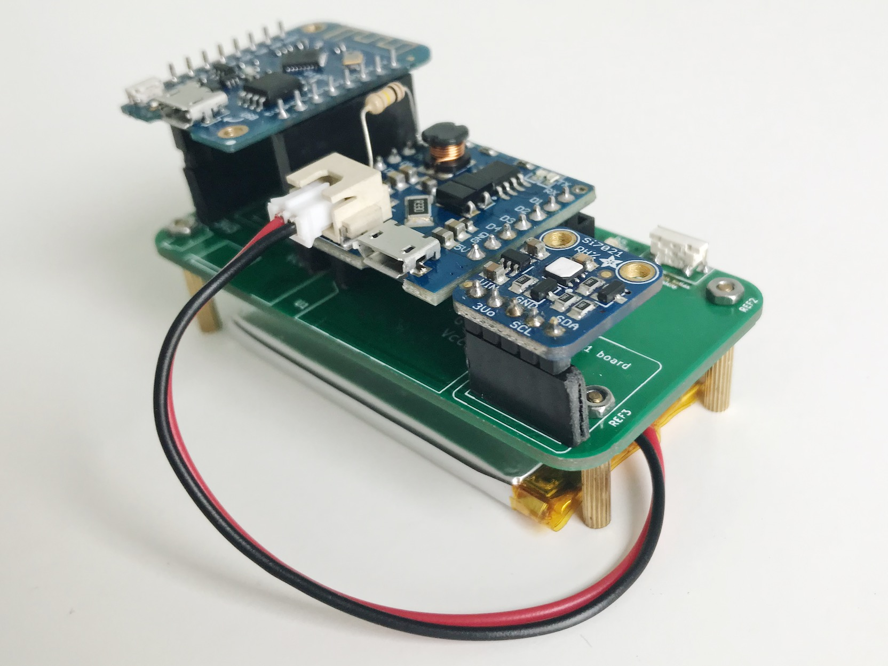
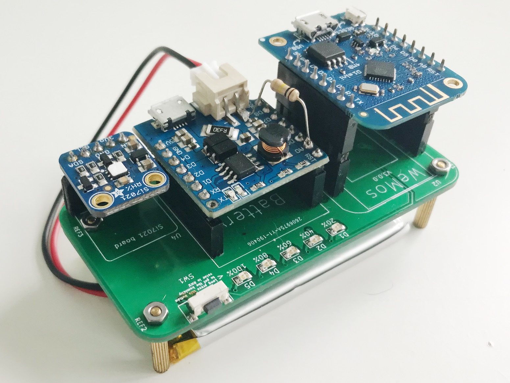

# Cactus

> Measure humidity and temperature periodically or on button press

- **Wireless:**	WiFi
- **Sensors:**	1 (Si7021)
- **Power:**	3.7V LiPo `1200mAh`
- **Processor:**	ESP8266 with WeMos D1 Mini
- **Modules:** 3 (MCU, power shield, sensor)
- **Firmware:**	Arduino ESP8266
- **OTA?**	No
- **Works without Internet?**	Yes
- **BOM Total Items:**	[35](bill_of_materials.csv)
- **BOM Unique Items:** 16
- **PCB Manufacturing vendor:**	JLCPCB
- **BOM vendor:** Mouser, AliExpress, 12Geeks, RS Components
- **Total vendors:** 5
- **Total units:** 1
- **Total cost:** USD 35.41
- **Battery life:** [4.5 months](power.md)

## Getting started

1. Setup an [IFTTT webhook](https://ifttt.com/services/maker_webhooks) to receive a POST request with data and add a row to a Google Spreadsheet

    
1. Connect to the access point

    
1. Go to the web page `http://192.168.4.1` to fill in the WiFi credentials and [IFTTT webhook key](https://ifttt.com/services/maker_webhooks/settings)

    
1. Wait for the [Google Sheet](https://docs.google.com/spreadsheets/d/1qedLXiCeU6vCwEvv3JqwrVWjrriB8L3DA9Xp-g01Jk0/edit?usp=sharing) to update with a new row

    

## Others

- [Hardware](hardware)
- [Firmware](firmware)
- [Bill of Materials](bill_of_materials.csv)
- [Design](design)
- [Power](power.md)
- [Mechanical](mechanical.md)
- [Schedule](schedule.md)
- [Components](components)
- [Live log](https://docs.google.com/spreadsheets/d/1qedLXiCeU6vCwEvv3JqwrVWjrriB8L3DA9Xp-g01Jk0/edit?usp=sharing)
- [Lessons Learnt](lessons.md)
- [References](references.md)
