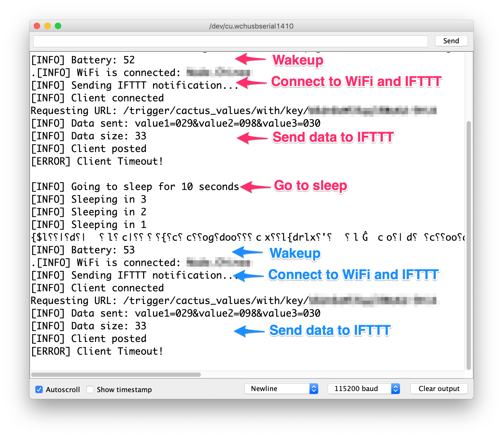

# Cactus

> Measure humidity and temperature periodically or on button press

- **Wireless:**	WiFi
- **Sensors:**	1 (Si7021)
- **Power:**	3.7V LiPo `1200mAh`
- **Processor:**	ESP8266 with WeMos D1 Mini
- **Modules:** 3 (MCU, power shield, sensor)
- **Firmware:**	Arduino ESP8266
- **OTA?**	No
- **Works without Internet?**	Yes
- **BOM Total Items:**	[35](bill_of_materials.csv)
- **BOM Unique Items:** 16
- **PCB Manufacturing vendor:**	JLCPCB
- **BOM vendor:** Mouser, AliExpress, 12Geeks, RS Components
- **Total vendors:** 5
- **Total units:** 1
- **Total cost:** USD 35.41
- **Battery life:** [4.5 months](battery.md)

## Getting started

1. Setup an [IFTTT webhook](https://ifttt.com/services/maker_webhooks) to receive a POST request with data and add a row to a Google Spreadsheet

    
1. Connect the [hardware](hardware) components
1. Flash the [main firmware](firmware/main.ino)
1. Connect to the access point

    
1. Go to the web page `http://192.168.4.1`

    
1. Key in the WiFi `SSID`, WiFi `password` and [IFTTT webhook key](https://ifttt.com/services/maker_webhooks/settings)
1. Switch back to your original WiFi access point with Internet
1. Wait for the [Google Sheet](https://docs.google.com/spreadsheets/d/1qedLXiCeU6vCwEvv3JqwrVWjrriB8L3DA9Xp-g01Jk0/edit?usp=sharing) to update with a new row

    
    

## Hardware

### Schematic

### Footprint

Front

Back

### 3D View

Front

Back

## Lessons Learnt

> Good practices to continue for future projects

- Always buy electronics modules for `V1.0`
- Ensure main BOM components are available from vendors before schematic or layout
- Do a power tree analysis starting with power source before the schematic design
- Test out paper mockups for mechanical dimensions
- Do a mechanical consideration before laying out the footprint
- Check pin, pitch, manufacturer part number, function before buying BOM parts
- Design a power on/off switch to start/stop using the battery
- Leave out the module's on-board LED as a possible separate indicator E.g. Not linking `GPIO02` to `EN` for the shift register

## References 📚

### Similar projects

1. [Shelly H&T is a Battery Powered ESP8266 WiFi Temperature & Humidity Sensor](https://www.cnx-software.com/2018/10/30/shelly-ht-battery-powered-esp8266-wifi-temperature-humidity-sensor/)

### Humidity and Temperature Sensor Si7021

1. [Adafruit Si7021 Temperature & Humidity Sensor Breakout Board](https://www.adafruit.com/product/3251)
1. [Arduino library for SI7020 and SI7021 environmental sensors](https://github.com/LowPowerLab/SI7021)
1. [MINI Si7021 Temperature and Humidity Senso](http://www.instructables.com/id/MINI-Si7021-Temperature-and-Humidity-Sensor/)
1. [ESP8266 and Si7021 temperature sensor example](https://www.esp8266learning.com/esp8266-si7021-temperature-sensor-example.php)

### Power

#### Coin Cell

1. [ESP8266 Sensor runs 17 days on a coin cell](https://www.youtube.com/watch?v=IYuYTfO6iOs)
1. [How to build an open WiFi finder using ESP8266 and two coin batteries](https://medium.com/@kstevica/how-to-build-an-open-wifi-finder-using-esp8266-and-two-coin-batteries-9c31eb6f9859)
1. [How to Run Your ESP8266 for Years on a Battery](https://openhomeautomation.net/esp8266-battery/)

#### Battery shield

1. [WeMos battery shield](https://arduinodiy.wordpress.com/2017/01/02/reviewing-the-wemos-battery-shield/)
1. [Power usage of WeMos and battery shield](http://harald.studiokubota.com/wordpress/index.php/2016/08/20/power-usage-of-wemos-d1-mini-ws2812b-rgb-shield/)
1. [Battery shield docs and schematic](https://wiki.wemos.cc/products:d1_mini_shields:battery_shield)
1. [WeMos lithium battery shield](https://www.youtube.com/watch?v=z6Vgy1cY0XU)
1. [Monitoring LiPo battery voltage with Wemos D1 minibattery shield and Thingspeak](https://arduinodiy.wordpress.com/2016/12/25/monitoring-lipo-battery-voltage-with-wemos-d1-minibattery-shield-and-thingspeak/)

### Programming

1. [ESP8266 pogo jig programming](https://hackaday.io/project/20046-esp8266-pogo-jig-programming-board)
