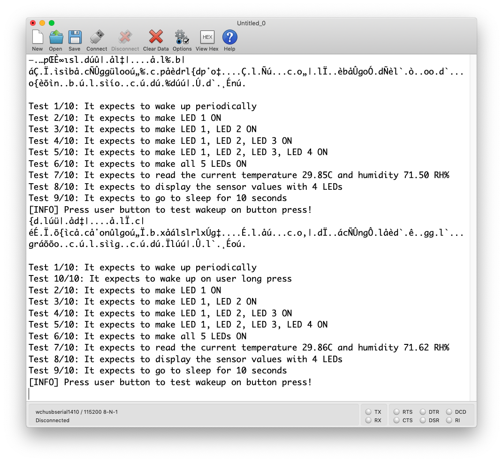

## Design verification test

### Arduino IDE settings

- Board: NodeMCU board ESP-12E
- Flash size: `4M`
- CPU Frequency: `80MHz`
- Upload speed: `115200`
- Port: `/dev/cu.wchusbserial1410`

Run [`test.ino`](test.ino) to ensure PCB works!

